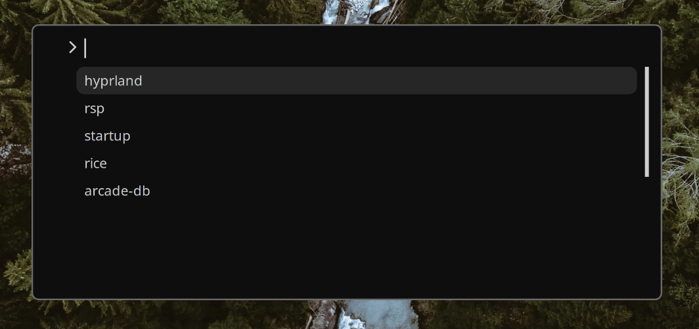

# 🦀RSP

> [!WARNING]
> RSP is currently only available on Linux with the Hyprland window manager and is compatible only with the kitty terminal.

# ⚡What is RSP ?

> [!NOTE]
> RSP, (Rust Starter Profiles), is a CLI tool written in Rust. Its aim is to simplify the management and launching of different work profiles, according to the user's needs. This simplifies the process of configuring the work or relaxation environment in a single command.

[](https://asciinema.org/a/lFCj436trKpmRBkVXZFAULlDs)

# 🔥Features

- Configuration profile management

- Launching profiles from the Terminal or Rofi

- Open applications in specific workspaces

# 🚀Rofi

```conf
# hyprland.conf
bind = $mainmod SHIFT, P, exec, .config/rsp/rsp_rofi.sh
```



# ⚙️Installation

> [!IMPORTANT]  
> Rust must be installed on your system.

Clone the repository :

```shell
git clone https://github.com/Itsoon/rsp.git; cd rsp
```

## 🤖Automated installation (Setup)

Run Setup :

```shell
./setup.sh
```

Installation check :

```shell
rsp --version
```

## 🔧Manual installation

Compiling :

```shell
cargo build --release
```

Copy the binary :

```shell
sudo cp ./target/release/rsp /usr/local/bin/
```

Copy configuration files.

```shell
cp -r ./config/rsp/ "$HOME/.config/"
```

Installation check :

```shell
rsp --version
```

# 📜Usage

```text
Usage: rsp [COMMAND]

🖥️ Commands:
  l, ls, list        Print available profiles
  <profile>          Processing profile
  h, help            Print this message or the help of the given subcommand(s)

🔧 Options:
  -l, -ls            Print available profiles
  -h, --help         Print help
  -v, -V, --version  Print version
```

To process a specific profile (replace <profile> with the profile ID or with the name):

```shell
❯ rsp l
0  default
1  start-up
2  hyprland
3  rsp
❯ rsp hyprland
Process launched and detached.
```
